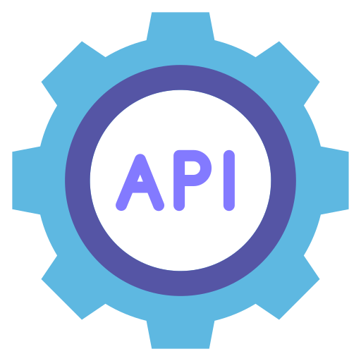
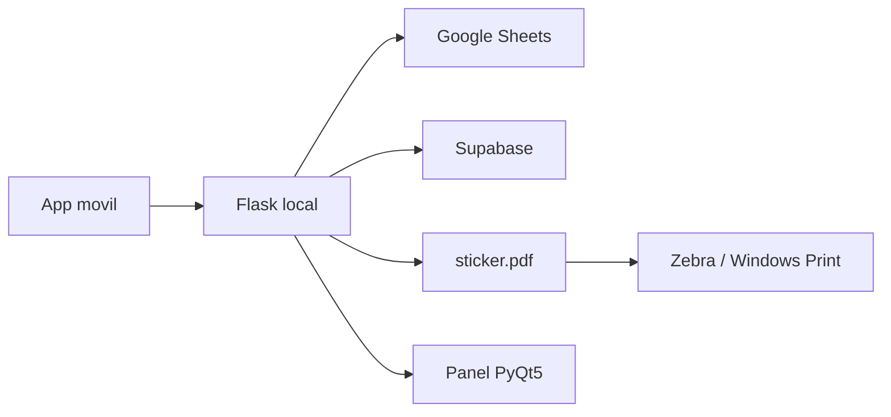

<p align="center">
  
</p>

<h1 align="center">API CoolImport V6.2.0</h1>

<p align="center">
  Servidor local de impresion para etiquetas textiles, QR, Kardex, Google Sheets, Supabase y Zebra.
</p>

<p align="center">
  <a href="https://github.com/JheissonLoor/coolimport-inventory-system/releases/tag/v6.2.0">
    
  </a>
  
  
  
</p>

---

## Que es

API CoolImport es una app de escritorio para Windows hecha con Flask + PyQt5. Recibe datos desde la app movil, genera una etiqueta `sticker.pdf` con QR y texto, y la envia a una impresora Zebra.

No trabaja con Excel local. La informacion viene de Google Sheets y Supabase.

## Flujo principal

| Paso | Componente | Resultado |
| --- | --- | --- |
| 1 | App movil | Envia QR, texto y acciones de inventario |
| 2 | Flask local | Recibe requests en la red local |
| 3 | Google Sheets / Supabase | Consulta stock, Kardex y datos auxiliares |
| 4 | Generador PDF | Crea `sticker.pdf` con QR y texto |
| 5 | PyQt5 + Windows Print | Muestra logs y envia a Zebra |



## Descargar version Windows

La version compilada esta publicada como release:

[Descargar API CoolImport V6.2.0](https://github.com/JheissonLoor/coolimport-inventory-system/releases/tag/v6.2.0)

El ZIP del release incluye el `.exe`, `_internal/` y archivos de ejemplo. No incluye `config.py`, `.env` ni JSON reales de Google.

Para usar el ZIP:

1. Descomprime `API-CoolImport-V6.2.0-windows.zip`.
2. Copia `config.example.py` como `config.py`.
3. Completa Supabase y Google Sheets en `config.py`.
4. Coloca el JSON de Google en `credentials/`.
5. Ejecuta `API CoolImport V6.2.0.exe`.

## Ejecutar desde codigo fuente

Requisitos:

- Python 3.11.
- Windows.
- Credenciales de Google Sheets en formato JSON.
- Variables de Supabase y Google Sheets en `config.py`.

Instalacion:

```powershell
python -m venv .venv
.\.venv\Scripts\Activate.ps1
pip install -r requirements.txt
```

Ejecucion:

```powershell
python generar_qr_pdf.py
```

## Configuracion

Copia `config.example.py` como `config.py` y completa:

```python
SUPABASE_URL = ""
SUPABASE_KEY = ""
SUPABASE_SERVICE_KEY = ""

GOOGLE_CREDENTIALS_FILE = "credentials/your-service-account.json"

STOCK_SPREADSHEET_ID = ""
AUXILIARY_SPREADSHEET_ID = ""

WORKSHEET_STOCK = "STOCK"
WORKSHEET_ALMACEN_MOVIMIENTOS = "Movimientos del almacen"
WORKSHEET_DATOS_KARDEX = "datosKardex"
WORKSHEET_STOCK_ACTUAL = "Stock Actual"
```

Reglas de seguridad:

- `config.py` no se sube al repo.
- `.env` no se sube al repo.
- Los JSON de `credentials/` no se suben al repo.
- El release no trae credenciales reales.

## Compilar EXE

Instala PyInstaller si no lo tienes:

```powershell
pip install pyinstaller
```

Compila:

```powershell
.\build.ps1
```

El build queda en:

```text
dist/API CoolImport V6.2.0/
```

El script copia al build:

- `README.md`
- `config.example.py`
- `.env.example`
- `credentials/README.md`
- assets de `img/`

No copia `config.py` ni JSON reales.

## Publicar release

El release debe llevar un ZIP del contenido de `dist/API CoolImport V6.2.0`, no `dist/` versionado en git.

Ejemplo:

```powershell
Compress-Archive -Path "dist\API CoolImport V6.2.0\*" -DestinationPath "release\API-CoolImport-V6.2.0-windows.zip" -Force
gh release create v6.2.0 "release\API-CoolImport-V6.2.0-windows.zip" --title "API CoolImport V6.2.0" --notes "Build Windows del servidor local de impresion."
```

## Estructura del repo

```text
.
|-- generar_qr_pdf.py       # App Flask + PyQt5 principal
|-- generar_qr.py           # Utilidad QR
|-- enterprise.py           # Utilidad enterprise / auth
|-- img/                    # Logos e imagenes del UI
|-- credentials/README.md   # Guia para llaves Google ignoradas
|-- config.example.py       # Plantilla de configuracion
|-- .env.example            # Plantilla opcional de variables
|-- build.ps1               # Build Windows con PyInstaller
`-- requirements.txt
```

## Archivos que nunca se suben

- `build/`
- `dist/`
- `release/`
- `*.spec`
- `_internal/`
- `*.exe`
- `sticker.pdf`
- `temp_qr*.png`
- `logs_consola.pdf`
- `config.py`
- `.env`
- JSON dentro de `credentials/`

## Propuestas de mejora

- Crear `/health` para validar Supabase, Google Sheets e impresora sin generar etiquetas.
- Agregar `DRY_RUN_PRINT=True` para probar PDF sin enviar a Zebra.
- Mover IPs conocidas, nombres de impresora y tamanos de etiqueta a `config.py`.
- Agregar tests para `/generar_kardex` y `/consulta_pcp` con mocks de Google Sheets.
- Crear logs rotativos en archivo para diagnosticar errores sin depender solo de la ventana PyQt5.
- Agregar version visible en la ventana para confirmar que la PC corre el build correcto.
- Automatizar releases con GitHub Actions cuando el proyecto ya no dependa del entorno local de Windows.

---

<p align="center">
  Repo de codigo fuente limpio. Builds y credenciales viven fuera de git.
</p>
